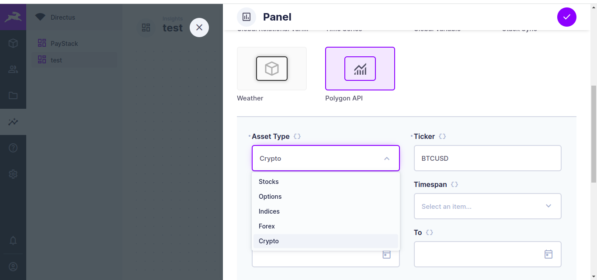
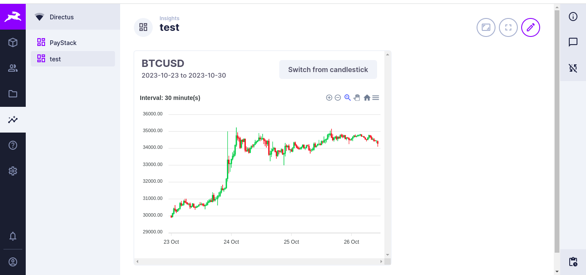
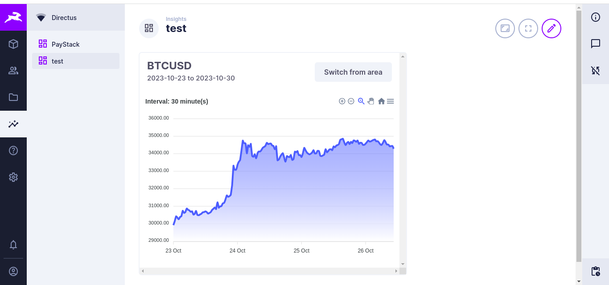

# Poly Trend Insights

PolyTrend leverages the Polygon API to provide financial market data and insights.

## Details

- Allow user access financial market data enabling them to analyse trends and make informed decisions.

- The project utilizes the Polygon API and data visualization with ApexCharts.

- It is panel extension accessible via the Directus insights dashboard.

- Further developments could implement real time updates

## Set Up Instructions

{ Include any instructions required to set up this submission - including any registrations for third-party services. }

Add the enviroment variable `POLYGON_API_KEY` to your directus `docker-compose.yml` file.

You can obtain a free API key from [Polygon](https://polygon.io/)

## Screenshots

## Collaborators

- [koredeycode](https://github.com/koredeycode)
